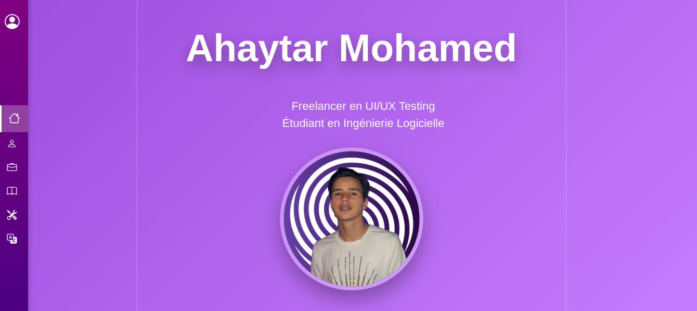

# Ahaytar Mohamed - Portfolio

Portfolio personnel moderne en une seule page, réalisé avec **HTML, CSS et Bootstrap 5** pour présenter mon parcours de **testeur UI/UX freelance** et **étudiant en Ingénierie Logicielle**.

Lien en ligne → (mets ici ton lien GitHub Pages ou hébergement quand c’est prêt)

## Fonctionnalités

- Design 100 % responsive
- Défilement fluide avec scroll-snap
- Menu latéral qui s’agrandit au survol
- Thème violet élégant et moderne
- Contenu aligné à gauche dans les sections Expérience & Formation
- Effets de cartes en glassmorphism et animations au survol

## Sections

- **Accueil** – Présentation et photo de profil
- **Profil** – À propos de moi et coordonnées
- **Expérience** – Testing UI/UX freelance (Tester Work, uTest…)
- **Formation** – Études actuelles et auto-formation
- **Compétences** – Outils de test, design, bure, Microsoft Office…
- **Langues** – Arabe (natif), Anglais (courant), Français (intermédiaire)

## Technologies utilisées

- HTML5
- CSS3 (avec variables)
- Bootstrap 5.3
- Bootstrap Icons
- JavaScript pur (défilement fluide + menu actif)

## Comment tester sur ton ordinateur

1. Télécharge ou clone le projet
2. Ouvre simplement le fichier `index.html` dans ton navigateur
3. C’est prêt ! Aucun outil supplémentaire requis

## Contact

- Email : m.ahaytar1457@uca.ac.ma
- Ville : Marrakech, Maroc
- Téléphone : +212 6 66 66 66 66

Fait avec ❤️ par Ahaytar Mohamed © 2025
